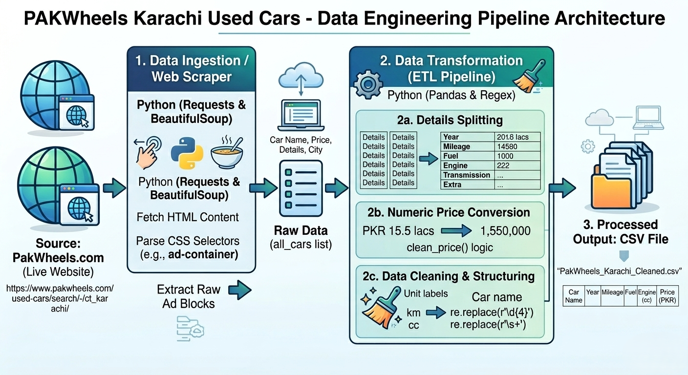

# **PakWheels Karachi Used Cars - Web Scraper & Data Pipeline**

An end-to-end data engineering project that scrapes used car listings from **PakWheels Karachi**, cleans the raw data using advanced Python techniques, and prepares a structured dataset for analysis.

## **🚀 Project Overview**
This project automates the collection of car market data from PakWheels. It handles everything from bypassing bot detection to converting complex string-based prices (lacs/crore) into clean numeric values.

### **Key Features:**
*   **Web Scraping:** Extracting car names, prices, and technical specs using `BeautifulSoup`.
*   **Data Cleaning:** Splitting merged detail strings into organized columns (Year, Mileage, Fuel, etc.).
*   **Numeric Transformation:** A custom pipeline to convert "Lacs" and "Crores" into raw integers for mathematical analysis.
*   **Regex Processing:** Using Regular Expressions to remove redundant text and years from car titles.
*   **Final Output:** A ready-to-use `.csv` file for Data Science or Machine Learning.

---

## **📂 Repository Structure**
*   `Case_Study.ipynb`: The main Jupyter Notebook containing the code.
*   `Explanation.md`: A deep, line-by-line technical breakdown of the script.
*   `PakWheels_Karachi_Cleaned.csv`: The final processed dataset.
*   `README.md`: Project documentation (this file).

---

## **🛠️ Tech Stack**
*   **Language:** Python 3.12
*   **Libraries:** 
    *   `Requests`: For fetching HTML content.
    *   `BeautifulSoup4`: For parsing and extracting specific web elements.
    *   `Pandas`: For data manipulation and CSV export.
    *   `Regex (re)`: For advanced string pattern matching and cleaning.

---

## **📊 Data Before & After**

### **Raw Data (Initial Scrape):**
| Car Name | Price | Details |
| :--- | :--- | :--- |
| Suzuki Alto 2010 VXR (CNG) for Sale | PKR 13.5 lacs | 2010 \| 168,033 km \| CNG \| 1000 cc \| Manual |

### **Cleaned Data (Final Output):**
| Car Name | Year | Mileage | Fuel | Engine (cc) | Price (PKR) |
| :--- | :--- | :--- | :--- | :--- | :--- |
| Suzuki Alto VXR (CNG) | 2010 | 168033 | CNG | 1000 | 1,350,000 |

---